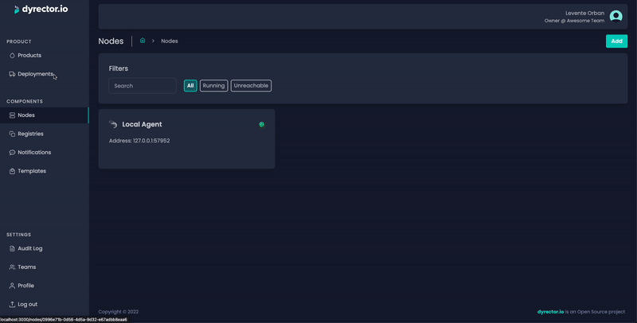
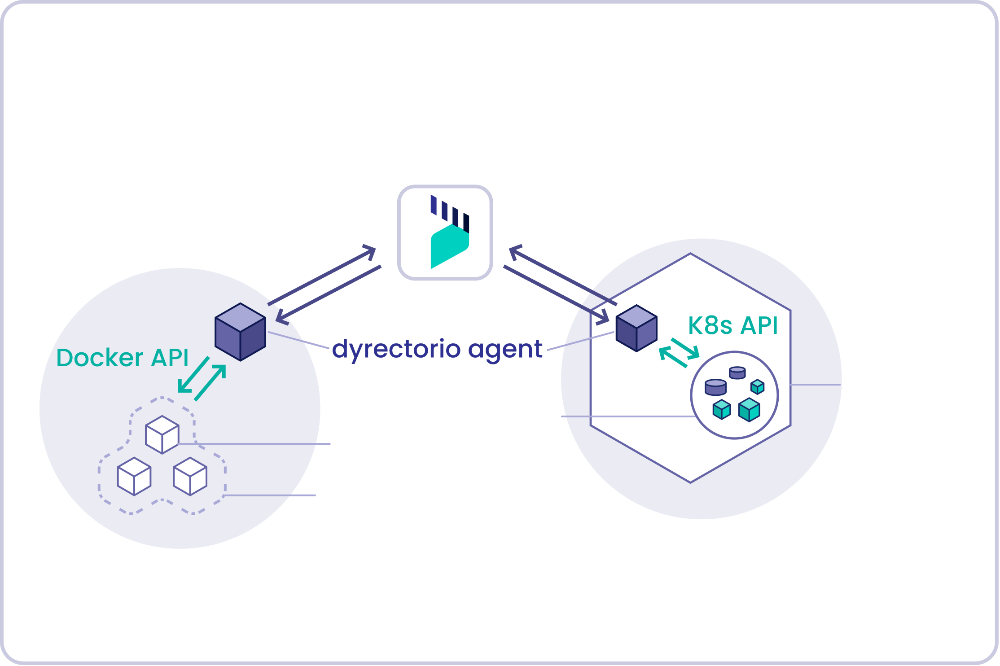

<p align="center">
  <a href="http://docs.dyrector.io/" target="blank">
    <picture>
      <source media="(prefers-color-scheme: dark)" srcset="docs/dyrectorio-dark.png">
      <source media="(prefers-color-scheme: light)" srcset="docs/dyrectorio-light.png">
      
    </picture>
  </a>
</p>

<p align="center">Open-source Internal Developer Platform (IDP) for developers and non-specialists to manage multi-instance deployments, microservices and configurations in Kubernetes & Docker.

<br>

</p>
<br>

<p align="center">
  <a href="https://github.com/dyrector-io/dyrectorio/tags" target="_blank"></a>
    <a href="./LICENSE" target="_blank"></a>
    <a href="https://discord.gg/pZWbd4fxga" target="_blank"></a>
    <a href="https://codecov.io/gh/dyrector-io/dyrectorio" target="_blank"></a>
    <a href="https://github.com/dyrector-io/dyrectorio/graphs/contributors" target="_blank"></a>
    <a href="https://github.com/dyrector-io/dyrectorio/issues" target="_blank"></a>
    <a href="https://twitter.com/dyrectorio" target="_blank"></a>
</p>

## Overview

dyrector.io is an open-source deployment platform that helps software teams manage releases & deployments easily and efficiently. While non-specialists are enabled to manage these processes in a simplified, self-service manner, specialists can deploy and manage containerized apps faster through the platform.

Our product is a platform for:

-   **DevOps & System Engineers** can build and manage robust cloud infrastructure
-   **Engineers** can focus more on developing the product because self-service deployments are faster
-   **Stakeholders** can deliver new functions and products with a higher velocity
-   **CTOs & Technical Managers** can reduce time-to-market, manage cloud costs more efficiently and maintain team productivity.

> **Warning**
> dyrector.io platform is under development, please treat as such. Expect bugs here and there. Early adopters welcome.


Join our Discord and connect with other members to share and learn together. If you like the project, give us a Star.

<a href="https://codecov.io/gh/dyrector-io/dyrectorio" target="_blank"></a>

## Key features

-   Kubernetes and Docker support
-   Multi-instance deployment
-   Instant test environments from any branches
-   Environment management
-   Secret and configuration management
-   Auto-generated changelogs and release notes (WIP)
-   Workflow support
-   Scheduled releases (WIP)
-   Audit log
-   Container Registry integrations
-   Fine-grained RBAC (WIP)
-   ChatOps & notification solutions

## How it works

dyrector.io consists of an agent (GoLang) and a platform (UI developed in React.js, Next.js. Backend developed in Node.js, Nest.js). There are two types of agents communicating with the platform: one for Docker and another for Kubernetes. Communication takes place in gRPC with TLS encryption. The data is managed in a PostgreSQL database which we use with Prisma ORM.

<p align="center">
    <picture>
      <source media="(prefers-color-scheme: dark)" srcset="docs/how-it-works-dark.png">
      <source media="(prefers-color-scheme: light)" srcset="docs/how-it-works-light.png">
      
    </picture>
</p>

## Use cases

### Multi-Instance Deployments

Trigger deployments of the same application to multiple environments from one place using the same or various configurations.

### Docker & Kubernetes utilization without specialists

Both Docker and Kubernetes require specialized staff to manage. Via dyrector.io, your team’s non-specialist staff can contribute to the process, as well.

### Instant test environments

Seamless testing whenever your team wants to test the application, without waiting for a SysAdmin to set up an environment.

## Get Started

dyrector.io CLI, is a command-line interface that lets you run and manage the whole dyrector.io project locally.

This means you get a full-featured dyrector.io platform running locally on your machine.

### Prerequirements

-   Docker installed on your system (Podman works, too).
-   Go Compiler to run the CLI from its source code. (Precompiled binaries are planned)

### With CLI

> **Note**
> The CLI is only available from the codebase at the moment.

1. Clone the repository to your local workdir with `git clone`
2. Execute `go run ./golang/cmd/dyo up` in the project root
3. Open the `localhost:8000` and use the platform

dyrector.io's command-line interface (CLI) lets you run a complete dyrector.io development environment locally with the following services: UI Service (crux-ui), Backend Service (crux), PostgreSQL databases, Authentication, Migrations, and SMTP mail server.

#### Using the platform with CLI for demonstration or testing

1. Execute `go run ./golang/cmd/dyo up` in the project root
2. After you navigated to `localhost:8000` (this is the default traefik port) you will see a Login screen
3. Register an account with whatever e-mail address you see fit (doesn't have to be valid one)
4. Navigate to `localhost:4436` where you will find your mail as all outgoing e-mails will land here
5. Open your e-mail message and using the link inside you can activate your account
6. Enjoy!

#### Using the platform with CLI for development

1. Read the CLI documentation first(see the end of this section)
2. Decide which part of the project you want to work on, in this case it is crux, crux-ui or both
3. Modify the CLI's settings file if you need it.
4. Execute the correct CLI command using the appropriate flags to turn off crux or crux-ui services
5. Start crux or crux-ui with the appropriate `npm` command, usually `npm run start`
6. After you navigated to `localhost:8000` (this is the default traefik port) you will see a Login screen
7. Register an account with whatever e-mail address you see fit (doesn't have to be valid one)
8. Navigate to `localhost:4436` where you will find your mail as all outgoing e-mails will land here
9. Open your e-mail message and using the link inside you can activate your account
10. Enjoy!

Read more about the CLI in the [documentation](https://docs.dyrector.io/get-started/cli).

### With Docker compose files

The easiest way to get started with the dyrector.io platform is by our premade [docker-compose](./web/docker-compose.dev.yaml) file.

1. First you have to create `.env` from `.env.example` files in your local environment, in the following folders: `/web`, `/web/crux`, `/web/crux-ui`

On _Windows_ and _Mac_ use `host.docker.internal` in the `.env` files for URLs.

2. Build the dyrector.io platform dependencies, this step is only required once:

```
docker-compose -f web/docker-compose.dev.yaml build
```

3. To run the dyrector.io platform dependencies:

```
docker-compose -f web/docker-compose.dev.yaml up
```

If you are having problems starting `crux-kratos-migrate` change the line endings of `web/kratos/entrypoint.sh` from CRLF to LF. These problems include `ERROR: Encountered errors while bringing up the project.` while running `docker-compose up` or `': No such file or directory` in the container log.

4. Now as all the infrastructure is ready, you need to install all the node.js dependencies in the specific projects' folder. To install all ( `web/crux/`, `web/crux-ui/` ) dependencies run `npm install`.

_on Apple Silicon run `npm install --target_arch=x64`_

5. In `crux/` folder you have to migrate the database and generate the Prisma client

```
npx prisma generate
npx prisma migrate deploy
```

6. To start services run `npm start` in the followind folders `/web/crux` and `/web/crux-ui`

7. Open the platform in `host.docker.internal:8000` and register

8. In local our auth service is using a mock, so you can confirm your email in `http://localhost:4436/`

9. Now you can log in and use the platform

### Hosted version (SaaS)

We are planning to support a hosted version in the near future.

## FAQ

-   How do I get in touch with the Support Team?

    You can contact dyrector.io support directly using our [contact forms](https://dyrector.io/contact) for users and developers or by reaching out to us via email at help@dyrector.io. Developers can get in touch via our Community Discord server.

-   Can we use dyrector.io without containerization?

    Unfortunately, we're unable to support applications that don't run in a containerization environment.

## Community

Also, follow dyrector.io on GitHub Discussions, our [Blog](https://blog.dyrector.io), and on [Twitter](https://twitter.com/dyrectorio). You can chat with the team and other members on [Discord](https://discord.gg/pZWbd4fxga).

dyrector.io is Open Source - This repository, and most of our other open source projects, are licensed under the Apache 2.0.

Join our Discord and connect with other members to share and learn together.
Send a pull request to any of our open source repositories on Github. Check our contribution guide and our developers guide for more details about how to contribute. We're looking forward to your contribution!

[](https://discord.gg/pZWbd4fxga)

## Contributing

The project can only accept contributions which are licensed under the [Apache License 2.0](LICENSE). For further information please see our [Contribution Guidelines](CONTRIBUTING.md).

## Changelog

Install the generator

```
go get -u github.com/git-chglog/git-chglog/cmd/git-chglog
```

Usage

```
git-chglog --next-tag vx.y.z -o CHANGELOG.md
```

```
git tag -a vx.y.z
git push --tags
```

In order to draft a new release:

-   create a new release tag on develop
-   generate changelogs

See [CHANGELOG.md](CHANGELOG.md)

## Feedback

We’d love to hear your thoughts on this project. Feel free to drop us a note!

## License

dyrector.io is open source software under the [Apache License 2.0](LICENSE). Complete license and copyright information can be found in the source code.

> Licensed under the Apache License, Version 2.0 (the "License"); you may not use this file except in compliance with the License. You may obtain a copy of the License at http://www.apache.org/licenses/LICENSE-2.0 Unless required by applicable law or agreed to in writing, software distributed under the License is distributed on an "AS IS" BASIS, WITHOUT WARRANTIES OR CONDITIONS OF ANY KIND, either express or implied. See the License for the specific language governing permissions and limitations under the License.

<!-- analytics -->
