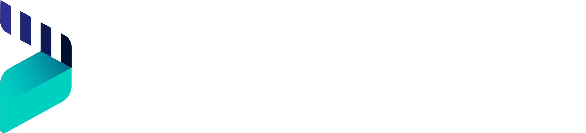

  <a href="http://docs.dyrector.io/" target="blank">
    <picture>
      <source media="(prefers-color-scheme: dark)" srcset="docs/dyrectorio-dark.png">
      <source media="(prefers-color-scheme: light)" srcset="docs/dyrectorio-light.png">
      
    </picture>
  </a>

dyrector.io is a self-hosted continuous delivery platform.

  
    
    
    
    
    
    

## Overview

dyrector.io helps engineer & DevOps teams and individual developers to shift their focus from maintaining and setting up their containerized applications to developing their software. The platform achieves this by offering continuous delivery and version management capabilities to your OCI containers.

> **Warning**
> The platform is under development, please treat as such. Expect bugs here and there. Early adopters welcome.

Join our Discord and connect with other members to share and learn together. If you like the project, give us a Star.

## Getting started
You have various options to set up the platform right away:
- [CLI](./GETTING_STARTED.md) 
- [SaaS](https://app.dyrectorio.com) 
- [docker-compose.yaml](./docker-compose.yaml)

## 🌊 Use cases

#### 🚢 Container utilization without commands

Interact with containers in Docker, Podman & Kubernetes without any experience to these technologies. Deploy, start, stop, and restart containers running locally or in remote infrastructures via the platform.

#### ⛴️ Configuration Abstractions & JSON editing

Configuration screen lets you to filter out the unnecessary common, Docker or Kubernetes variables to avoid misconfiguration. JSON editing is still available.

#### ⛵️ Multi-Instance Deployments

Trigger deployments of the same stack to multiple environments from one interface using the same or various configurations.

#### 🛳️ Instant sandbox environments

Turn your local setup into a test & demo environment by deploying your container to it via the platform.

## Demo

https://user-images.githubusercontent.com/9247788/219671903-41da385e-4f8f-4fba-a7e4-c6ec4f727b7f.mp4

## Key features

-   Kubernetes, Docker and Podman support
-   Multi-instance deployment
-   Instant test environments from any branches
-   Environment management
-   Secret and configuration management
-   Auto-generated changelogs and release notes
-   Workflow support
-   Scheduled releases
-   Audit log
-   Container Registry integrations
-   Fine-grained RBAC
-   ChatOps & notification solutions

## Hosted version (SaaS)

Besides the self-hosted instance, you can check out the platform's alpha at [app.dyrectorio.com](https://app.dyrectorio.com). The platform is still in the works, we might reset the database, so it's not recommended for production yet. In case you are interested about using dyrector.io in production, reach out to us via [email](hello@dyrector.io) and we'll set up a stable instance for you.

## How it works

dyrector.io consists of an agent (GoLang) and a platform (UI developed in React.js, Next.js. Backend developed in Node.js, Nest.js). There are two types of agents communicating with the platform: one for Docker and another for Kubernetes. Communication takes place in gRPC with TLS encryption. The data is managed in a PostgreSQL database which we use with Prisma ORM.

    <picture>
      <source media="(prefers-color-scheme: dark)" srcset="docs/how-it-works-dark.png">
      <source media="(prefers-color-scheme: light)" srcset="docs/how-it-works-light.png">
      
    </picture>

## FAQ

If you have any questions, check out [FAQ](https://docs.dyrector.io/learn-more/faq) or reach out to us on [Discord](https://discord.gg/pZWbd4fxga).

## Community

Also, follow us on GitHub Discussions, our [Blog](https://blog.dyrector.io), and on [Twitter](https://twitter.com/dyrectorio). You can chat with the team and other members on [Discord](https://discord.gg/pZWbd4fxga).

dyrector.io is Open Source - This repository, and most of our other open source projects, are licensed under the Apache 2.0.

Join our Discord and connect with other members to share and learn together.
Send a pull request to any of our open source repositories on Github. Check our contribution guide and our developers guide for more details about how to contribute. We're looking forward to your contribution!

## Contributing

The project can only accept contributions which are licensed under the [Apache License 2.0](LICENSE). For further information please see our [Contribution Guidelines](CONTRIBUTING.md).

## Releases

We use [semantic versioning](https://semver.org/), but shifted to the right, we don't bump major versions yet, until we reach beta phase.

Minor version is raised if:

-   introduction of a braking API change (proto or HTTP)
-   new feature set is completed
-   milestone is reached
-   agent configuration changes

Patch version is raised if:

-   important fixes in develop
-   any other reason

## Feedback

We’d love to hear your thoughts on this project. Feel free to drop us a note!

## License

dyrector.io is open source software under the [Apache License 2.0](LICENSE). Complete license and copyright information can be found in the source code.

> Licensed under the Apache License, Version 2.0 (the "License"); you may not use this file except in compliance with the License. You may obtain a copy of the License at http://www.apache.org/licenses/LICENSE-2.0 Unless required by applicable law or agreed to in writing, software distributed under the License is distributed on an "AS IS" BASIS, WITHOUT WARRANTIES OR CONDITIONS OF ANY KIND, either express or implied. See the License for the specific language governing permissions and limitations under the License.
