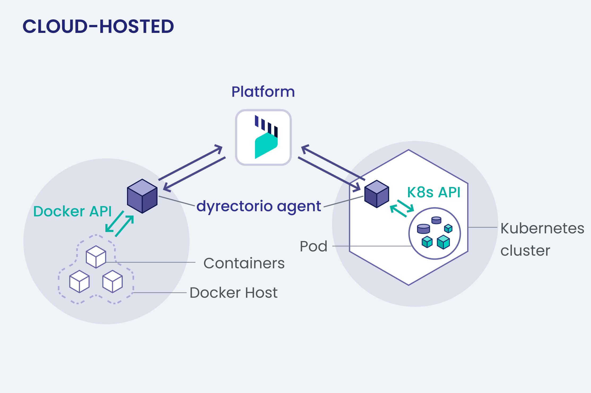
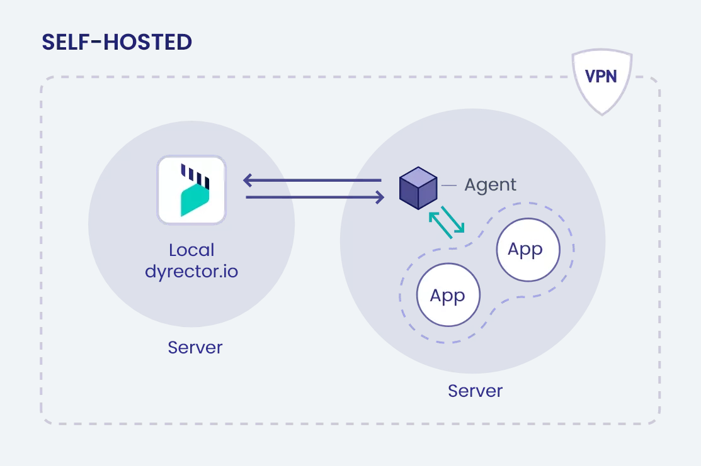

# How it works

### Architecture

You can use dyrector.io in a cloud-hosted or a self-hosted way.

#### Cloud-hosted

By using cloud-hosted dyrector.io, you’re able to register dyrector.io’s agent to your Nodes. When adding a Node, you can select whether you’d like to use Docker API or Kubernetes API on it.

To add a Node, you need to run the one-liner script generated by us in your Node’s terminal.

This is how dyrector.io will operate if you decide to use our free or paid packages.

#### Self-hosted

Similar to the cloud-hosted way, you can use self-hosted dyrector.io with Docker or Kubernetes. Only difference is it’s up to you where dyrector.io will run.

If you don’t want to configure your own dyrector.io, check our packages to see one that’ll fit your needs.
