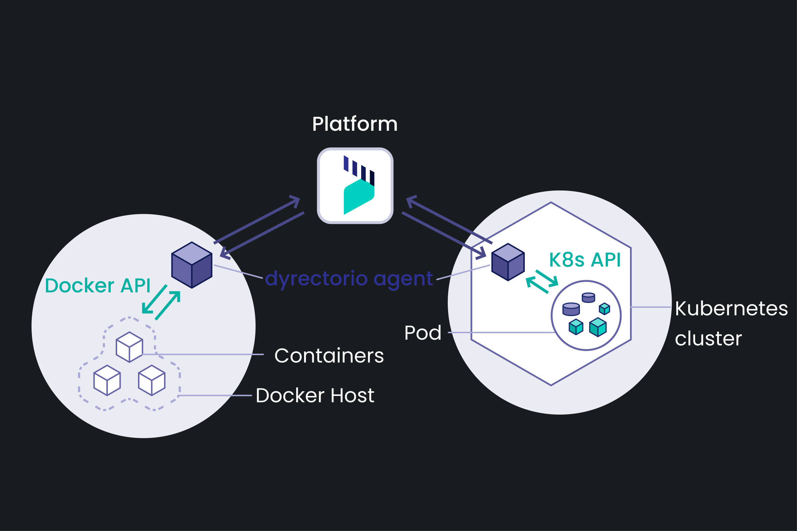
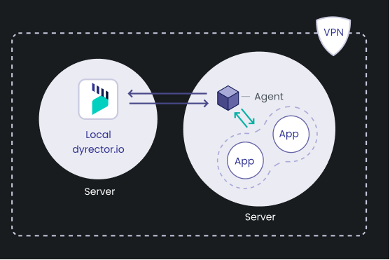

# How it works

dyrector.io consists of an agent (GoLang) and a platform (UI developed in React.js, Next.js. Backend developed in Node.js, Nest.js). There are two types of agents communicating with the platform: one for Docker and another for Kubernetes. Communication takes place in gRPC with TLS encryption. The data is managed in a PostgreSQL database which we use with Prisma ORM.

### Architecture

You can use dyrector.io in a cloud-hosted or a self-hosted way.

#### Cloud-hosted – Unavailable in v0.1.1

By using cloud-hosted dyrector.io, you’re able to register dyrector.io’s agent to your Nodes. When adding a Node, you can select whether you’d like to use Docker API or Kubernetes API on it.

To add a Node, you need to run the one-liner script generated by us in your Node’s terminal. The one-liner script will run a script that'll install dyrector.io's agent to your Node.


**As of now, you can only use dyrector.io in a self-hosted manner. Cloud-hosted access is in the works.**


This is how dyrector.io will operate if you decide to use our free or paid packages. Learn more about our packages [**here**](../learn-more/pricing.md).

#### Self-hosted

Similar to the cloud-hosted way, you can use self-hosted dyrector.io with Docker or Kubernetes. Only difference is it’s up to you where dyrector.io will run.

If you don’t want to configure your own dyrector.io, check our packages to see one that’ll fit your needs.


One of the most important benefits of self-hosted dyrector.io is that you can use the environment where you run dyrector.io as an instant test environment.

