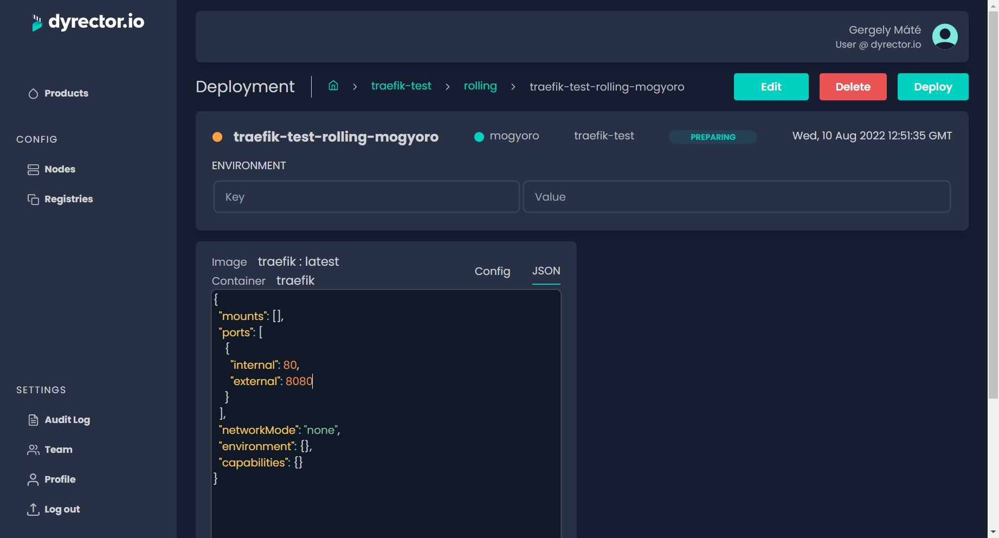

# Configuration management

Configurations can be all over the place without a single source of truth when left unmanaged for long periods of time. The more configurations you need to deal with, the more likely you’ll lose track of them. dyrector.io can be used as single source of truth for all of your configurations, while being able to add, remove or modify configurations directly or via the JSON editor.

Every configuration you specify will remain stored after any modification or deletion to ensure you won’t have to spend time again defining already specified configurations.

### How is it better than using a Git repository?

Git repositories containing the configurations of your microservice architecture can be all over the place because one repo won’t cover all the configurations for all the images & components in your architecture. dyrector.io substitutes Git repos by bringing every variable that belong to a specific Product in one place.

#### Use cases

* **Think ahead:** designing is the first step towards efficient and secure configuration management. Go through your organization’s structure, consider privileges and access points. This step is crucial for more efficient configuration management.
* **Configuration roll back:** if it turns out the new configuration variables need to be reworked to maintain uptime of your application, you can roll back the last functioning ones.
* **In progress – Bundled configurations:** instead of specifying the same configurations one by one to each component, you can apply variables to multiple components with one click by bundling them up.

### Configuration customization

You're able to define configurations for both [**Product images**](../tutorials/create-your-product/) and [**Deployments**](../tutorials/deploy-your-product.md). Variables that belong to images can be overwritten by Deployment variables.

#### JSON

You're also able to customize your configuration in JSON format, for easier copying. The variables by default are the following:

The result should look like this:

<pre class="language-json5"><code class="lang-json5">{
  // Running application container name.
  "name": "mysql",
  // Path/volume bindings for containers.
  "mounts": ["data|/var/lib/mysql"],
<strong>  // Maps an internal 80 to external 8080, external refers to the host's port.
</strong>  "ports": [
    {
      "internal": 80,
      "external": 8080
    }
  ],
  // Docker specific networkMode configuration, can be host or none.
  "networkMode": "none",
  // Environment variables used to configure application behavior.
  // Tribute to https://12factor.net
  "environment": {},
  // WIP (not available yet) configure container behavior based on annotations.
  "capabilities": {},
  // If managed ingress is enabled on node (traefik or ingress is deployed)
  // ingress could be generated here. This is for http traffic for now.
  "expose": {"public": true, "tls": true}
}</code></pre>
