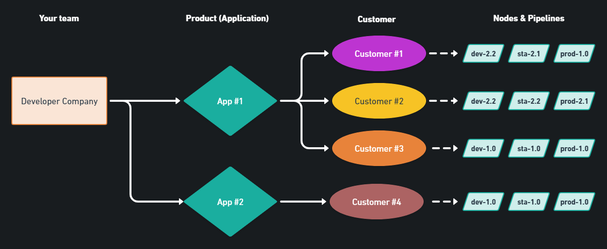
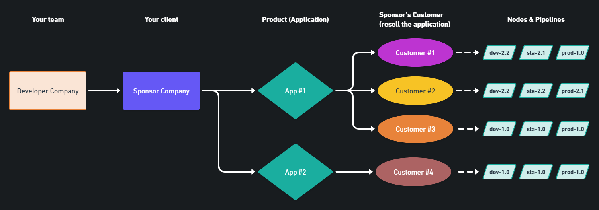

# Use cases

#### Multi-Instance Deployments

Microservice architectures are challenging to manage, especially when your team has to distribute them through multiple Nodes. Deployments become repetitive, time-consuming, and due to human presence, risky.

By using dyrector.io, you can simplify the whole process. Assemble your images from private or public Registries in an instant, then trigger the deployments to Nodes – on-prem or cloud environments.

The most common use case of Multi-Instance Deployments is when your team directly distributes the applications they create. The flowchart below illustrates how the process takes place.

We've seen less frequently but at significant levels that when a company outsources the development of an application to your team, they'd still like to manage deployments because they handle billing and other administrative processes. In the flowchart below you can see how this process differs from direct distribution.

> **In progress:** Bundled configurations enable your team to assign templatized configurations through the whole process. This significantly reduces the risk of adding incorrect configurations.

#### Docker & Kubernetes utilization without specialists

Both Docker and Kubernetes require specialized staff to manage. Via dyrector.io, your team’s non-specialist staff can contribute to the process, as well.

No worries if you’d rather have your specialists handling these processes, however. Your specialists can also save time and effort spent on image and containerized app management by using dyrector.io. They’ll even appreciate that their teammates can check on statuses on dyrector.io without looking for input and feedback from SysAdmins and DevOps staff.

#### Instant test environments

Imagine you’re a project manager and one of the developers on your team lets you know that a new function is ready for testing. Instead of contacting a SysAdmin or a DevOps engineer, you’re able to set up testing or staging environments in an instant by creating a new Node, described in the [**Register your Node**](../tutorials/register-your-node.md) tutorial.

If you’re running dyrector.io on-premises, the process is even more simple. All you have to do is deploy the application you’d like to test to the Node where dyrector.io runs using the steps of [**Create the Product**](../tutorials/create-your-product/) tutorial.

**And more, including**

* Installing Next.js apps with Nginx to a VPS or a Kubernetes cluster
* Installing single images (like RabbitMQ or a database)
* Checking server/cluster status
