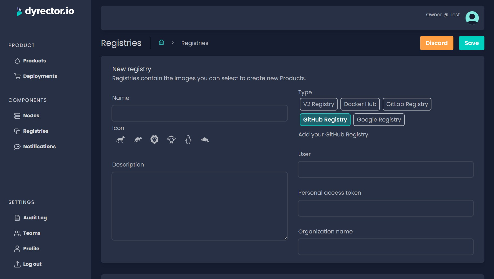

# Add GitHub Registry

**Step 1:** Open Registries on the left and click ‘Add’ on the top right.

**Step 2:** Enter your registry’s Name and select an Icon.


**Tip:** You can write a description, so others on your team can understand what’s the purpose of this registry.


**Step 3:** Select GitHub Registry type.

**Step 4:** In the corresponding fields, enter:

* your GitHub username,
* Personal access token generated in GitHub with the steps documented [**here**](https://docs.github.com/en/authentication/keeping-your-account-and-data-secure/creating-a-personal-access-token). Select the _repo_ and _read:packages_ scopes.
* And your Organization’s GitHub name.

**Step 5:** Click ‘Save’ button on the top right.
