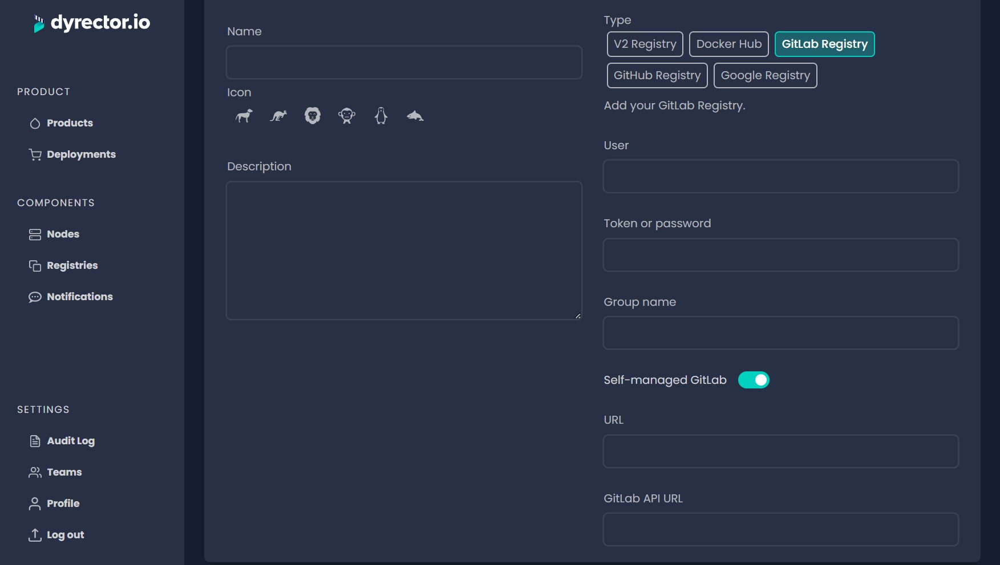

# Add GitLab Registry


You can add Registries available from both self-managed or SaaS GitLab.


### Add SaaS GitLab Registry

**Step 1:** Open Registries on the left and click ‘Add’ on the top right.

**Step 2:** Enter your registry’s Name and select an Icon.


**Tip:** You can write a description, so others on your team can understand what’s the purpose of this registry.


**Step 3:** Select GitLab Registry type.

**Step 4:** In the corresponding fields, enter:

* your GitLab username,
* your password or access token generated in GitLab with the steps documented [**here**](https://gitlab.com/-/profile/personal\_access\_tokens). Select the _read\_api_ and _read\_registry_ scopes.
* And your Organization’s GitHub name.

**Step 5:** Switch toggle to SaaS. If you select GitLab Registry type, SaaS should be selected by default.

**Step 6:** Click ‘Save’ button on the top right.

### Add Self-managed GitLab Registry

**Step 1:** Open Registries on the left and click ‘Add’ on the top right.

**Step 2:** Enter your registry’s Name and select an Icon.


Tip: You can write a description, so others on your team can understand what’s the purpose of this registry.


**Step 3:** Select GitLab Registry type.

**Step 4:** In the corresponding fields, enter:

* your GitLab username,
* your password or access token generated in GitLab with the steps documented [**here**](https://gitlab.com/-/profile/personal\_access\_tokens). Select the _read\_api_ and _read\_registry_ scopes.
* And your Organization’s GitHub name.

**Step 5:** Switch toggle to Self-managed GitLab.

**Step 6:** Enter GitLab Registry’s URL and the GitLab API URL without the https prefixes.

**Step 7:** Click ‘Save’ button on the top right.
