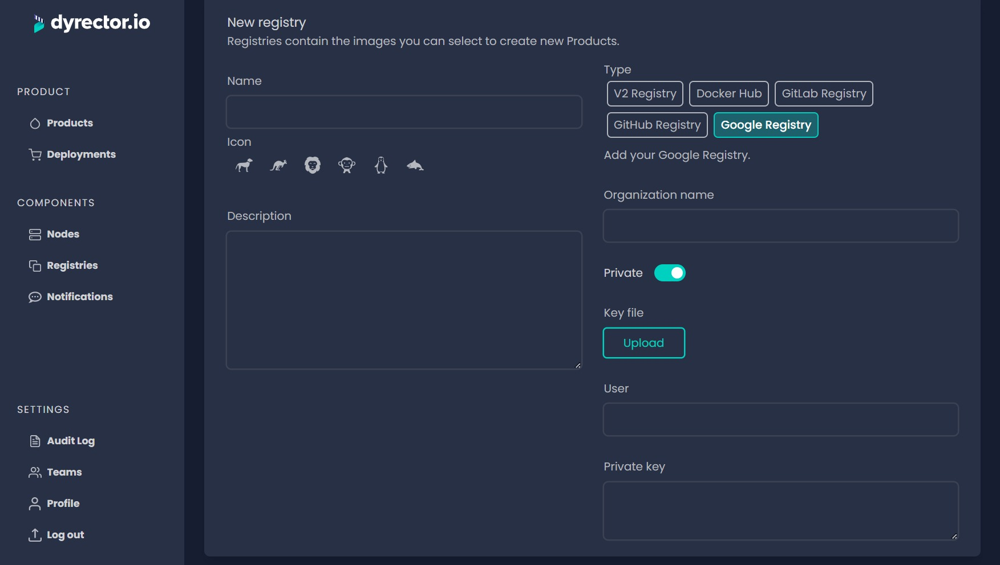

# Add Google Registry

### Add a Private Google Registry

**Step 1:** Open Registries on the left and click ‘Add’ on the top right.

**Step 2:** Enter your registry’s Name and select an Icon.


**Tip:** You can write a description, so others on your team can understand what’s the purpose of this registry.


**Step 3:** Select Google Registry and switch the toggle under the URL field to ‘Private’.

**Step 4:** In the corresponding fields, enter the Organization name. Upload the JSON key file you can generate as documented [**here**](https://cloud.google.com/container-registry/docs/advanced-authentication#json-key). In the Google Cloud documentation you only need to follow instructions until the 2nd part.

**Step 5:** Click ‘Save’ button on the top right.

### **Add a Public Google Registry**

**Step 1:** Open Registries on the left and click ‘Add’ on the top right.

**Step 2:** Enter your registry’s Name and select an Icon below.


**Tip:** You can write a description, so others on your team can understand what’s the purpose of this registry.


**Step 3:** Select Google Registry type and switch the toggle under the URL field to ‘Public’.

**Step 4:** Enter the Organization name.

**Step 5:** Click ‘Save’ button on the top right.
