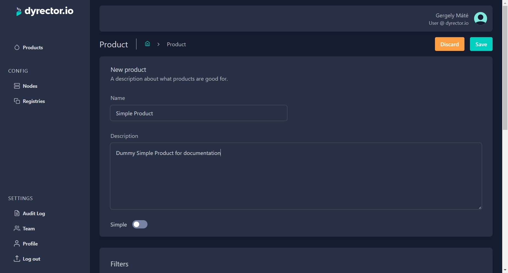
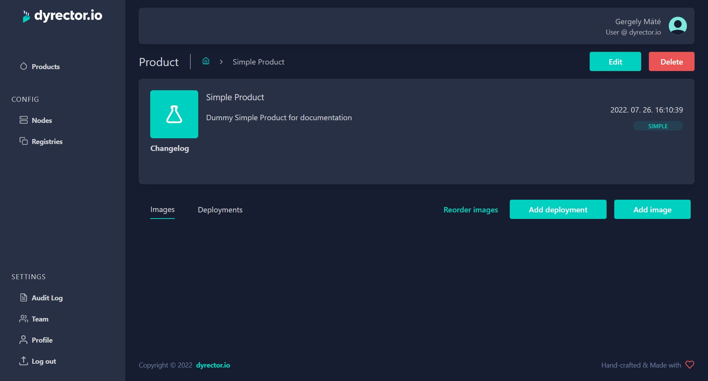
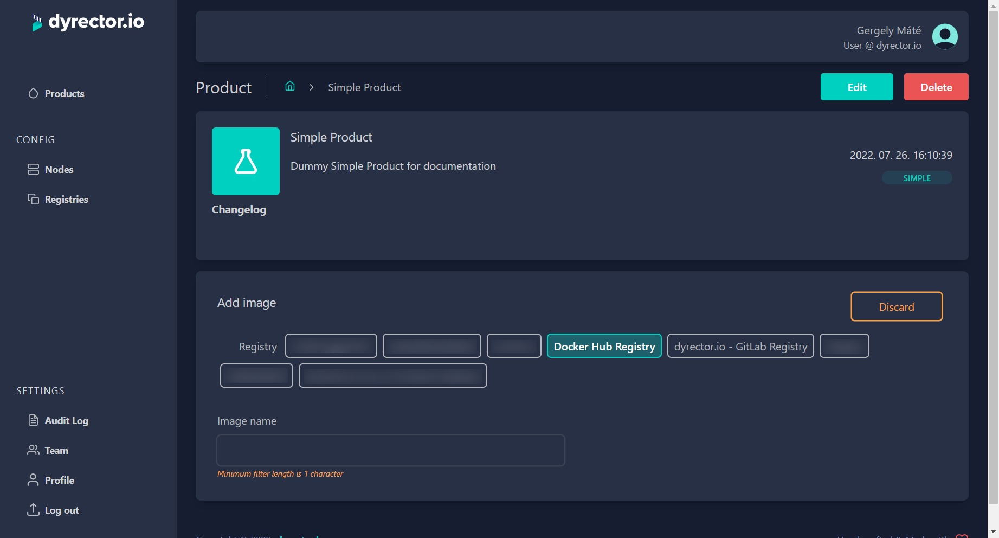
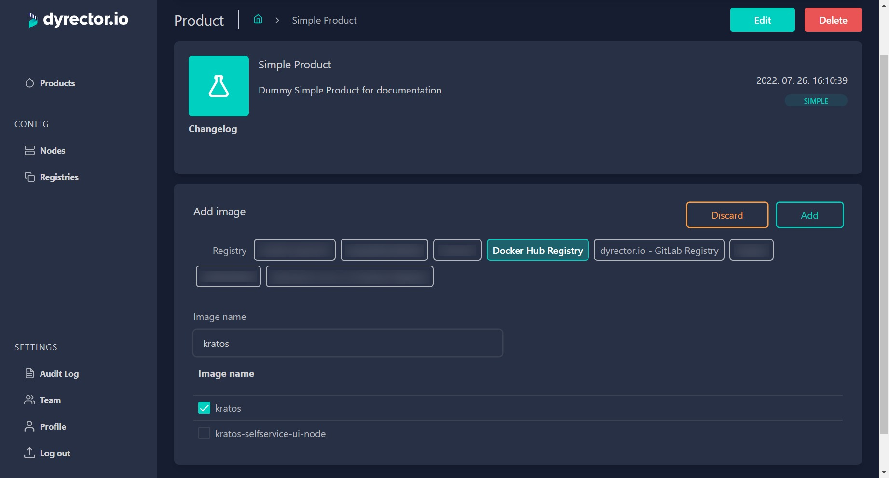
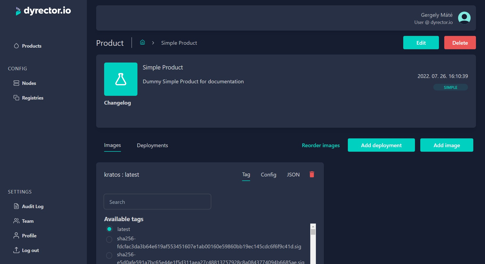

# Create a Simple Product

Simple Products have only one version and cannot be rolled back. These are mostly useful for testing purposes, because Simple Products come without versions.

**Step 1:** On the Product tab, click ‘Add’ on top right.

**Step 2:** Enter the Product’s name.


**Tip:** You can write a description so your teammates can understand what’s the purpose of this Simple Product.


**Step 3:** Select Simple on the switch under description.

**Step 4:** Click ‘Save’. You’ll be directed to the Product tab. Select the Product you just created.

**Step 5:** Click ‘Add Image’.

**Step 6:** Select the Registry you want to filter images from.

**Step 7:** Type the image’s name to filter images. Select the image by clicking on the checkbox next to it.

**Step 8:** Click ‘Add’.

**Step 9:** Pick the ‘Tag’, which is a version of the image you selected in the previous step. Now the image is added to your product.


Now you can define environment configurations to the selected image. For further adjustments, click on the JSON tab where you can define other variables. Copy and paste it to another image when necessary. Learn more about Configuration management [**here**](../../features/configuration-management.md).


**Step 10:** Click ‘Add Image’ to add another image. Repeat until you have all the desired images included in your product.
